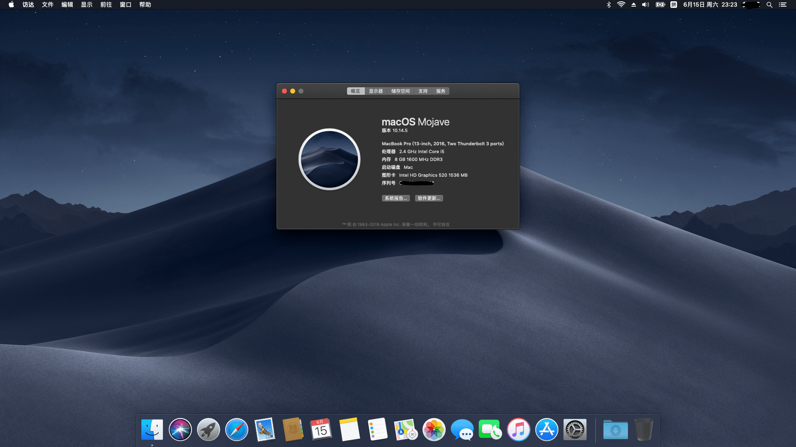

# Acer-K50-10-525V-Hackintosh
🍎 Acer K50-10-525V Hackintosh Configuration (use Clover 🍀)

# Summary

This is a repo containing the files for Clover used to make most things working on the Acer K50-10-525V.

The specifications of K50-10-525V are following:

* CPU: Intel Core i5-6200U (GPU: Intel HD Graphics 520)
* RAM: 8G DDR3L 1600MHz
* Hard disk: WD 1TB HDD & Sandisk 240GB SSD (I used the SSD to install macOS.)
* Graphics card: Nvidia GeForce 940M 2G
* Sound card: Realtek High Definition Audio
* Network: Realrek RTL8168/8111/8112 Gigabit Ethernet Controller
* Wireless & Bluetooth: Atheros Qualcomm Atheros QCA9377 (I replaced it with Broadcom DW1560/BCM94532Z.)
* Display: 15.6" 1080P built-in display
* Camare: 720P Camare
* Interfaces: USB 3.0, USB 2.0, SD card reader, HDMI, VGA, Headphone jack

Everything works well on macOS Mojave 10.14.5 including **Airdrop** and **Handoff**. Of course something didn't work, like **screen brightness adjustment**.

And I didn't check the SD card reader because I don't have any SD cards to test.

# How To Use

1. Download a macOS installation mirror with Clover from Internet, and then transfer to a USB drive.
2. Clone this repo to the local.
3. Mount the EFI partition of the USB drive, and then replace the CLOVER folder on the EFI partition with the CLOVER folder which in the repo you downloaded at the previos step.
4. Reboot your computer and boot from your USB drive and install macOS by following the installation guide. (At this step, you may reboot your computer for several times)
5. Wait for completion of the installation, enter the macOS, set up your system and then enjoy your Hackintosh!

# Notes

I install macOS Mojave 10.14.5, and Mojave have not supported Nvidia Graphics Card yet, so my Nvidia graphics card didn't work. If you install macOS 10.13.X, the Nvidia graphics card should work.

And the built-in wireless & bluetooth adapter of my computer is Atheros Qualcomm Atheros QCA9377, but it didn't work. So I replaced it with Broadcom BCM94532Z which cost me 225 RMB. Although it was a little expensive, it works prefect and it supports Airdrop and Handoff! So if you want these two functions and the interface of your adapter is NGFF(M.2), I suggest you buy BCM94532Z or BCM943602BAED(faster and more expensive).

# Screenshot

# References

* [B站黑苹果安装教程](https://www.sqlsec.com/2018/08/clover.html)
* [Hackintosh黑苹果长期维护机型EFI及安装教程整理](https://github.com/daliansky/Hackintosh)
* [【黑果小兵】macOS Mojave 10.14.5 18F132 正式版 with Clover 4928原版镜像](https://blog.daliansky.net/macOS-Mojave-10.14.5-18F132-official-version-with-Clover-4928-original-image.html)
* [Acer K50 macOS](https://github.com/khs1994/acer-k50-macos)
* [黑苹果建议的无线网卡 Hackintosh Compatible WiFi(20190505增加无线路由器推荐)](https://www.itpwd.com/330.html)
* [Broadcom BCM94352z/DW1560驱动新姿势[新方法]](https://blog.daliansky.net/Broadcom-BCM94352z-DW1560-drive-new-posture.html)
* [VoodooHDA 2.9.2-V13](https://github.com/chris1111/VoodooHDA-2.9.2-Clover-V13)
* [[Guide] How to Enable Backlight Control on Laptop](https://www.elitemacx86.com/threads/guide-how-to-enable-backlight-control-on-laptop.182/)

